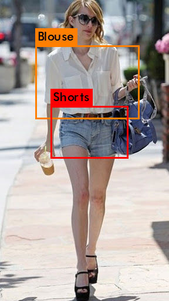
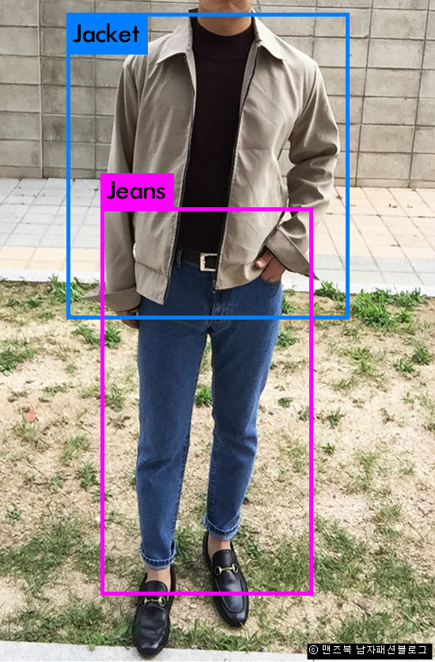

# Subject
행인의 옷을 인식하여 어떤 옷인지 파악한 후 그 정보를 바탕으로 행인의 성별을 추정한다.

# Team
2015104154 김동근

2015104156 김명락

# How to

1. pip install -r pip_list_reference.txt
2. cd /path/to/darknet
3. ./darknet detector test custom_data/detector.data custom_data/cfg/yolov3-custom-test.cfg backup/yolov3-custom_21000.weights
4. insert image path
5. check result

# Result

 